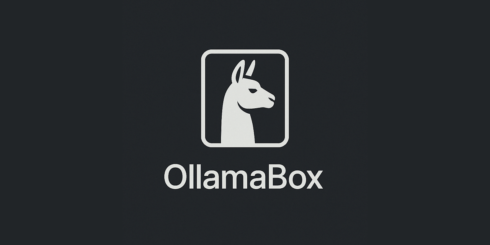

  

    

**OllamaBox** is a powerful Delphi wrapper for [Ollama](https://ollama.com) that allows developers to seamlessly download, extract, run, and interface with the Ollama runtime entirely within their application’s process. Unlike traditional setups that require background services or separate daemon processes, OllamaBox runs Ollama as a fully embedded, self-managed component—giving you complete control over inference, API access, and model management without leaving your app.

### :sparkles: Features

- :package: Download and unzip the latest Ollama release
- :rocket: Run Ollama directly in your app process (no background daemon)
- :electric_plug: Full access to Ollama's local REST API
- :brain: Stream results from models like LLaMA 3, Gemma, Phi, and more
- :file_folder: Custom model/data paths supported
- :white_check_mark: Simple setup, no dependencies outside of Delphi RTL

> 🚧️ **This repository is currently under construction.**
>  
> OllamaBox is actively being developed. Features, APIs, and internal structure are subject to change.  
>  
> Contributions, feedback, and issue reports are welcome as the project evolves.

## 🛠️ Support and Resources

- 🐞 **Report issues** via the [Issue Tracker](https://github.com/tinyBigGAMES/OllamaBox/issues).
- 💬 **Engage in discussions** on the [Forum](https://github.com/tinyBigGAMES/OllamaBox/discussions) and [Discord](https://discord.gg/tPWjMwK).
- 📚 **Learn more** at [Learn Delphi](https://learndelphi.org).

## 🤝 Contributing  

Contributions to **✨ OllamaBox** are highly encouraged! 🌟  
- 🐛 **Report Issues:** Submit issues if you encounter bugs or need help.  
- 💡 **Suggest Features:** Share your ideas to make **OllamaBox** even better.  
- 🔧 **Create Pull Requests:** Help expand the capabilities and robustness of the library.  

Your contributions make a difference! 🙌✨

#### Contributors 👥🤝
 

## 📜 Licensing

**OllamaBox** is distributed under the **🆓 BSD-3-Clause License**, allowing for redistribution and use in both source and binary forms, with or without modification, under specific conditions.  
See the [📜 LICENSE](https://github.com/tinyBigGAMES/OllamaBox?tab=BSD-3-Clause-1-ov-file#BSD-3-Clause-1-ov-file) file for more details.

---

🦙📦 OllamaBox – Embed and control Ollama directly from your Delphi app.

<h5 align="center">
  
Made with ❤️ in Delphi  